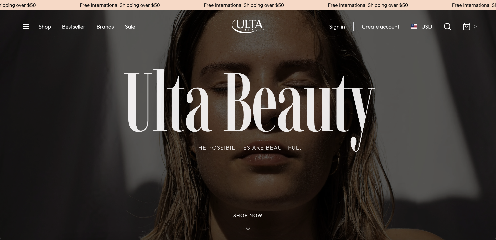

# Grupo Axo - Frontend Code Challenge

Una recreación de la página principal de Ulta Beauty, desarrollada como parte del Frontend Code Challenge de Grupo Axo.

## Preview



## Objetivo

Recrear una versión simplificada de la página principal de un ecommerce, inspirada en ULTA Beauty. Este proyecto evalúa habilidades con React, HTML/CSS, y la capacidad para estructurar componentes reutilizables, responsivos y bien organizados.

## Características Implementadas

### Hero Banner
- Banner principal con imagen de fondo
- Texto promocional (título y subtítulo)
- Botón de acción "Shop Now"
- Banner completamente clickeable que redirige a Google
- Diseño responsivo

### Carrusel de Productos
- **12 productos** con información completa
- Cada producto incluye:
  - Imagen del producto
  - Marca
  - Nombre del producto
  - Precio
  - Calificación (estática con estrellas)
  - Botón "Add to bag"
- **2 productos** con etiqueta rosada "Free Gift With Purchase"
- **Productos con descuento** mostrando badge "20% Off"
- Carrusel horizontal scrollable

### Sección de Categorías - "Summer-ready beauty"
- **Tres bloques principales:**
  - Makeup
  - Skin care
  - Hair care
- Cada bloque incluye imagen y título
- Botones "Shop Now" para cada categoría

### Bonus - Countdown Timer
- Promoción "All candles 2x1 - Last Chance"
- Contador en tiempo real con:
  - Horas
  - Minutos
  - Segundos
- Tiene un target date de "2025-07-15T18:00:00"  y cuenta regresiva en tiempo real

## Tecnologías Utilizadas

- **React** (Componentes funcionales con hooks)
- **TypeScript** (Para mejor tipado y desarrollo)
- **TailwindCSS** (Flexbox y Grid)
- **Vite** (Herramienta de construcción)
- **Clean Architecture** (Organización del código)

## 📁 Estructura del Proyecto

```plaintext
src/
├── features/
│   └── product/
│       ├── data/
│       │   ├── datasources/
│       │   ├── interfaces/
│       │   └── repositories/
│       ├── domain/
│       │   ├── models/
│       │   ├── repositories/
│       │   └── usecases/
│       └── presentation/
│           └── controllers/
├── hooks/
├── shared/
│   ├── components/
│   │   ├── common/
│   │   ├── layout/
│   │   └── screens/
│   ├── config/
│   └── constants/

```
## Instalación y Ejecución

### Prerrequisitos

- Node.js (versión 16 o superior)
- npm o yarn

### Pasos para ejecutar

1. Clonar el repositorio:

```bash
git clone https://github.com/Leonardo-Toledo-V/ulta-axo-challenge
cd ulta-axo-challenge
```

## Instalación

### Instalar dependencias:

```bash
npm install
```

### Crear archivo .env:
```bash
touch .env
```

### Agregar en el .env la siguiente línea:
```bash
VITE_API_URL="nombre de la api"
```
En este caso utilicé la API pública de "https://makeup-api.herokuapp.com", así equ el endpoint principal de la API es el siguiente:
```bash
http://makeup-api.herokuapp.com/api/v1/products.json
```

### Ejecutar el proyecto:

```bash
npm run dev
```

### Abrir en el navegador:

```
http://localhost:5173
```

---

## Responsividad

El proyecto está optimizado para diferentes tamaños de pantalla:

- Desktop (1200px en adelante)
- Tablet (768px - 1199px)
- Mobile (320px - 767px)

---

## Características de Diseño

- Paleta de colores inspirada en Ulta Beauty  
- Tipografía moderna y legible  
- Animaciones suaves en hover y transiciones  
- Badges y etiquetas para promociones  
- Sistema de rating con estrellas  
- Botones interactivos con feedback visual  

---

## Funcionalidades Técnicas

- Componentes reutilizables y modulares  
- Props dinámicas para renderizado de contenido  
- Hooks personalizados para lógica de negocio  
- Gestión de estado con React hooks  
- Arquitectura limpia con separación de responsabilidades  
- TypeScript para type safety  

---

## Criterios Cumplidos

- Estructura y limpieza del código  
- Separación en componentes reutilizables  
- Uso correcto de props y renderizado dinámico  
- Responsividad básica (mobile-friendly)  
- Creatividad y atención a detalles visuales  
- Bonus: Countdown timer funcional  

---

## Deploy

Ver proyecto en vivo: [Click aquí](https://ulta-axo-challenge.vercel.app/)  
Desplegado en Vercel.

---

## Autor

**Tu Nombre**  
GitHub: [@Leonardo-Toledo-V](https://github.com/Leonardo-Toledo-V)  
LinkedIn: [Leonardo Toledo Velazco](https://www.linkedin.com/in/leonardotoledov/)  

---

## Notas del Desarrollo

- Se utilizó una arquitectura limpia para facilitar el mantenimiento  
- Honestamente no había visto la imagen de referencia así que puedo decir que el diseño es completamente desde cero y creado por mi.  
- Se implementaron todas las características requeridas  

